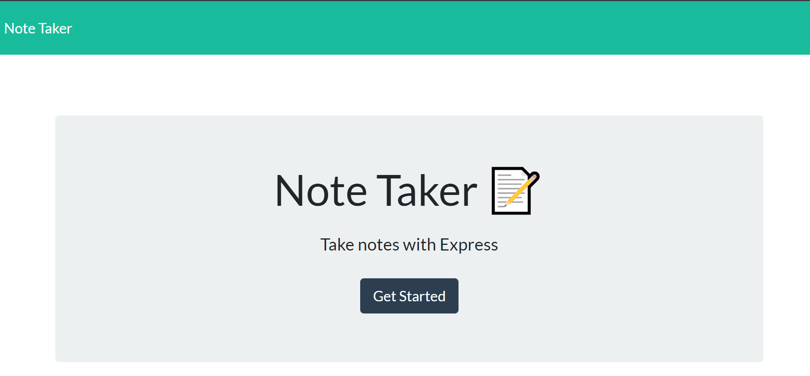

  [](https://opensource.org/licenses/MIT)

  # Note Taker

  
  ## Description
    
  This application provides users with the ability to record notes using a front end setup that allowes users to Create, Read, and Delete data from the back-end JSON file using API fetch.

  
  ## Demo
    
  
  

  [View Live Site Here](https://ch-note-taker.herokuapp.com/)
  

  
  ## Built With
  
     

  
## Table of Contents
    
  * [Installation](#Installation)
* [License](#License)
  

  
## Installation
  
Users should run ```npm install``` 
  

  

  
  ## License
    
  [](https://opensource.org/licenses/MIT)
    

  

  

  

  ### &copy; 2022 Charlton H
  